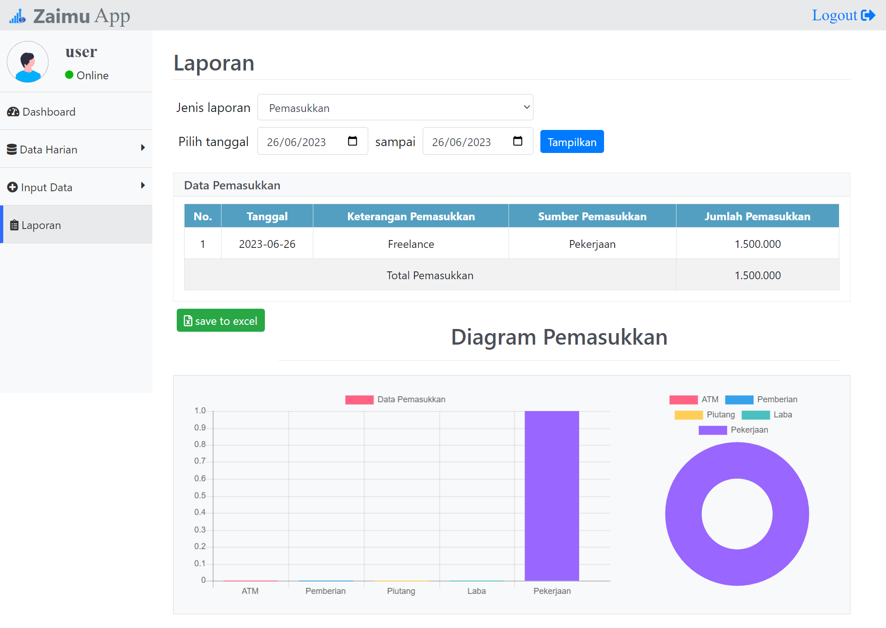

## Kelompok 5
  Nama Software: Aplikasi Manajemen Keuangan
<<<<<<< HEAD

  Alias: Zaimu App

  Kode: Z001

  Versi: 1.0

  Dikembangkan Oleh: 
  - Muhammad Hilmi 			            (9882405121111001)
  - Muhamad Januar Indra Praja	        (9882405121111014)
  - Reyhan Febrizio Resman 		        (9882405121111021)	
=======
  
  Alias: Zaimu App
  
  Kode: Z001
  
  Versi: 1.0

  Dikembangkan Oleh: 
  - Muhammad Hilmi 			(9882405121111001)
  - Muhamad Januar Indra Praja	        (9882405121111014)
  - Reyhan Febrizio Resman 		(9882405121111021)	
>>>>>>> 9d42f9033d5511e800713b7b11478dc39d3bf3e9

# Pencatatan Keuangan Harian
Aplikasi pencatatan keuangan harian ini memiliki tampilan yang sederhana dan fitur yang mampu berfungsi dengan baik.

To access. Example http://localhost/zaimuapp-main/index.php

## Tampilan Aplikasi

## Admin & User Account
|  Username | Password     |
|:---------:|---------:    |
|  admin    |  adolf12345  |
|  user     |  user12345   |

## Sistem Requirement
- Database MySQL
- XAMPP /PHP 8.2.0
- Server : XAMPP

<<<<<<< HEAD
https://github.com/Humble011/zaimuapp
=======
  https://github.com/Humble011/zaimuapp
>>>>>>> 9d42f9033d5511e800713b7b11478dc39d3bf3e9

